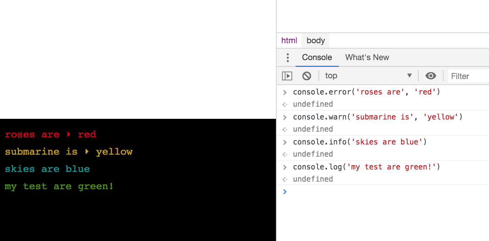

# &lt;visual-logger&gt;

> Displays calls to `window.console` methods in a visual terminal using [Xterm.js](https://xtermjs.org/).

[](https://visual-logger.now.sh/)

🚀 **Demo:** [https://visual-logger.now.sh/](https://visual-logger.now.sh/)

This webcomponent follows the [open-wc](https://github.com/open-wc/open-wc) recommendation.

## Installation

```bash
npm i @kuscamara/visual-logger
```

## Usage

⚠️ **Important:** Due to differences in module bundlers ([see issue in xtermjs repo](https://github.com/xtermjs/xterm.js/issues/2486)) handling exports, the component does not import `xterm` by itself and uses `window.Terminal` `constructor`, so **`xterm` should be loaded in `window` before the component**.   
`xterm` is also required as `devDependency` for the tests.

Include the component in your page and start using `window.console` methods.

```html
<script src="https://unpkg.com/xterm@4.4.0/lib/xterm.js"></script>
<script type="module" src="node_modules/@kuscamara/visual-logger/visual-logger.js"></script>

<visual-logger></visual-logger>
```

## Options

### [API](api.md)

Check out the **[API docs](api.md)** for the complete list of properties / attributes and methods.

### Disabling browser logging (`window.console`)

Set `noConsole` to `true`.

```html
<visual-logger no-console></visual-logger>
```

### Excluding `console` methods

Config the excluded methods in `excludedLogMethods` (`array`)

```html
<visual-logger excluded-log-methods='["error"]'></visual-logger>
```

### Xterm styles

The required styles for the terminal are loaded by default from a CDN (cdnjs.cloudflare.com), so you don't need to import them manually. If you need to load the stylesheet from a different location, use the `stylesheet-uri` attribute to specify the path.

```html
<visual-logger stylesheet-uri="node_modules/xterm/css/xterm.css"></visual-logger>
```

### Changing size

The height (`rows`) and column width (`cols`) can be changed after or before initialization.

```html
<visual-logger rows="10" cols="120"></visual-logger>
```

### Customizing styles

The default terminal styles (background, ANSI colors and font styles) can be customized using the [`theme` option of Xterm.js](https://xtermjs.org/docs/api/terminal/interfaces/itheme/).

The component **does not use Shadow DOM**, so it can be customized from the outside using `visual-editor` tag.

```css
visual-editor > div {
  padding: 20px;
}
```

### Programmatically usage

Each of the `window.console` methods (`log`, `warn`, `info`, `error`) has a corresponding component method that accepts the same params.

_Note: only the first two params are shown in the terminal._

```html
<visual-logger></visual-logger>

<script>
  document.querySelector('visual-logger').log('Hello world!');
</script>
```

## Development

The following commands are available for development:

- `npm start`: Starts the development server.
- `npm t`: Runs the tests with coverage output.
- `npm run test:watch`: Runs the test in watch mode. The browser runner is available at http://localhost:9876/
- `npm run lint`: Runs [web component analyzer](https://www.npmjs.com/package/web-component-analyzer), eslint and prettier.
- `npm run format`: Runs linters fixing errors.
- `npm run docs`: Updates the API docs in [api.md](api.md) file and `custom-elements.json`.

## License

This project is licensed under the [MIT License](LICENSE).
